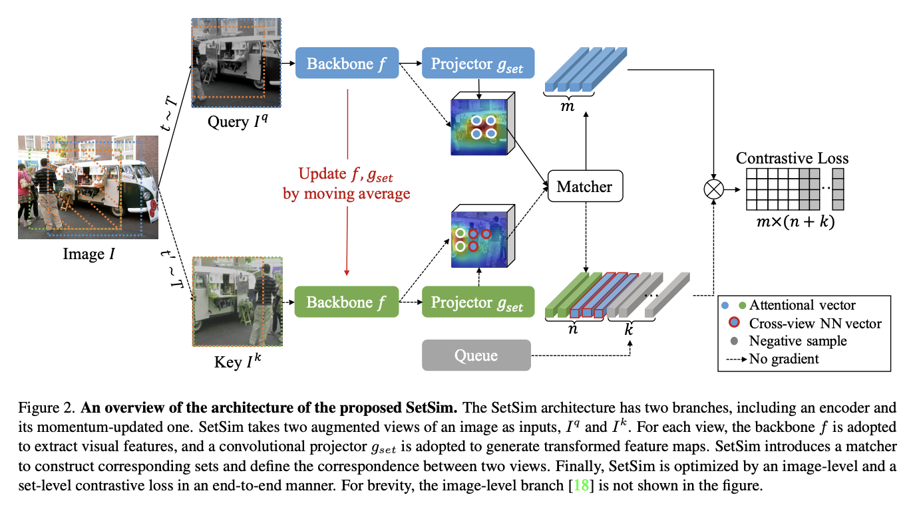
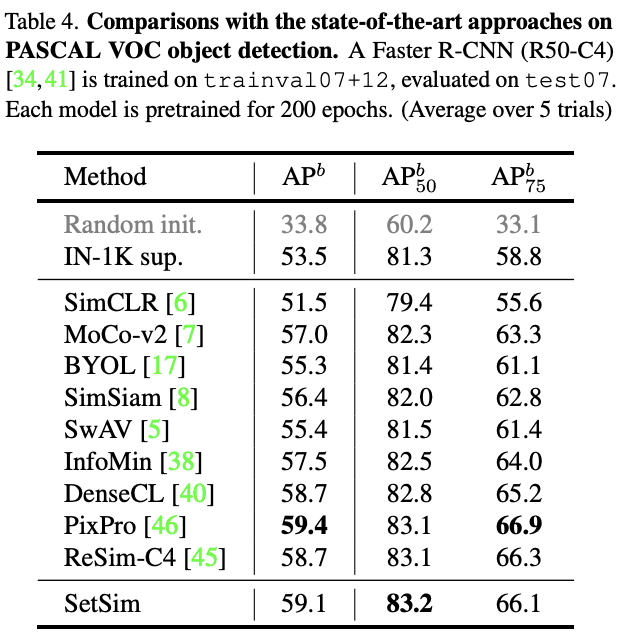

## [CVPR 2022] Exploring Set Similarity for Dense Self-supervised Representation Learning


<p align="center">
  
</p>

This is a PyTorch implementation of [our paper.](https://openreview.net/pdf?id=JAezPMehaUu)
```
@inproceedings{wang2022exploring,
  title={Exploring set similarity for dense self-supervised representation learning},
  author={Wang, Zhaoqing and Li, Qiang and Zhang, Guoxin and Wan, Pengfei and Zheng, Wen and Wang, Nannan and Gong, Mingming and Liu, Tongliang},
  booktitle={Proceedings of the IEEE/CVF Conference on Computer Vision and Pattern Recognition},
  pages={16590--16599},
  year={2022}
}
```


### Requirements

- Python >= 3.7.12
- PyTorch >= 1.10.2
- torchvision >= 0.11.3

Install PyTorch and ImageNet dataset following the [official PyTorch ImageNet training code](https://github.com/pytorch/examples/tree/master/imagenet).

For other dependencies, please run:
```
pip install -r requirements.txt
```

### Unsupervised Pre-training

This implementation only supports **multi-gpu**, **DistributedDataParallel** training, which is faster and simpler; single-gpu or DataParallel training is not supported.

To do unsupervised pre-training of a ResNet-50 model on ImageNet in an 8-gpu machine, please run:
```
bash train_pretrain.sh
```

### Linear Classification

With a pre-trained model, to train a supervised linear classifier on frozen features/weights in an 8-gpu machine, please run:
```
bash train_lincls.sh
```

### Fine-tuning on Pascal VOC object detection

With a pre-trained model, to fine-tune a Faster R-CNN on unfrozen features/weights in an 8-gpu machine, please run:
```
bash train_det.sh
```
<p align="center">
  
</p>


### License
This project is under the MIT license. See the [LICENSE](LICENSE) file for more details.